# Electric Vehicle Routing Problem – EVRP

## Project Overview

The Electric Vehicle Routing Problem (EVRP) is a complex combinatorial optimization challenge central to logistics and urban transportation. It involves routing a fleet of battery-constrained electric vehicles (EVs) to serve customers within specified time windows while minimizing travel distance and respecting charging constraints. This project tackles EVRP using Deep Reinforcement Learning (DRL), inspired by the pioneering LIN202 framework, to develop adaptive and scalable routing solutions. Conducted as part of an academic internship focused on reinforcement learning approaches, this research aims to push the boundaries of intelligent routing under realistic EV operational constraints.

## Objectives

- Model the EVRP as a reinforcement learning environment reflecting battery limitations, time windows, and charging station availability.
- Develop, implement, and train RL agents (e.g., DQN, PPO, policy gradient methods) to generate feasible and energy-efficient routing policies.
- Benchmark RL models against classical optimization approaches such as heuristics and mixed-integer linear programming.
- Evaluate model scalability, route efficiency, and charging optimization across diverse problem instances.

## Methodology Summary

The approach represents the routing problem as a graph, encompassing customers, charging stations, and depot nodes. Each node encodes local data (coordinates, customer demand, time windows) and global system states (current time, battery level, available EVs). The core RL model uses a graph embedding technique (Structure2Vec) combined with an attention mechanism and an LSTM decoder to estimate action probabilities for route construction. The training process employs policy gradient optimization with a rollout baseline, guided by a reward function balancing route distance minimization, constraint satisfaction, and penalty terms for infeasibilities.

## Repository Structure

```text
📦 evrp-rl
┣ 📂 src/ # RL models, environment, and utility code
┣ 📂 data/ # Benchmark datasets and synthetic instance generators
┣ 📂 experiments/ # Experiment scripts and Jupyter notebooks
┣ 📂 results/ # Model outputs, route visualizations, and metrics
┣ 📂 docs/ # Literature reviews, reports, and academic papers
┣ README.md
┣ LICENSE
┗ CODE_OF_CONDUCT.md
```

## Architecture



See `docs/ARCHITECTURE_DIAGRAM.md` for a Mermaid source, ASCII fallback, sequence diagram, data shapes, and extension points.

## Getting Started

### Prerequisites

- Python 3.10 or higher
- TensorFlow or PyTorch
- NumPy
- Pandas
- Matplotlib

### Installation

```shell
git clone https://github.com/sdley/evrp-rl.git
cd evrp-rl
pip install -r requirements.txt
```

### Running Experiments

#### Using the Modular Framework (Recommended)

The project now includes a **modular RL framework** for running configurable experiments:

```python
# Using YAML configuration
from src.framework import ConfigLoader, run_experiment

config = ConfigLoader.load('configs/experiment_config.yaml')
run_experiment(config)
```

Or programmatically:

```python
from src.framework import create_experiment_config, run_experiment

config = create_experiment_config(
    env_config={'num_customers': 20, 'num_chargers': 5},
    agent_config={'type': 'sac', 'encoder': {'type': 'gat'}},
    run_config={'epochs': 100, 'name': 'my_experiment'}
)
run_experiment(config)
```

See [`src/framework/README.md`](src/framework/README.md) for complete documentation.

### Full Pipeline Prompt Example

If you want a single script that runs a complete end-to-end experiment (parses YAML, initializes modular components, runs training on synthetic benchmarks, evaluates on held-out scenarios, plots convergence, and performs greedy inference), use the prompt below as a concise spec for a `scripts/train_full.py` implementation or for README examples:

"Complete end-to-end train script: parse YAML, init modular components, train on synthetic benchmarks (gen 1M instances like Node20/5). Eval on held-out, plot convergence. Inference: greedy decode (argmax no sample). Reference Reinforce-paper end-to-end GAT+attention decoder."

A scaffold script is available at `scripts/train_full.py` which demonstrates a safe, short demo run and can be scaled by setting `num_train_episodes` / `num_eval_episodes` in your YAML or using CLI flags.

#### Using Legacy Training Scripts

To train the RL agent using legacy scripts:

```python
python src/train_agent.py
```

Other scripts and notebooks for evaluation and visualization are available in the `experiments/` directory.

## Framework Features

The modular framework (`src/framework/`) provides:

- ✨ **Config-Driven**: Define experiments in YAML or Python
- 🏭 **Factory Pattern**: Create environments, encoders, and agents from configs
- 🎯 **Multiple Algorithms**: A2C and SAC agents
- 🧠 **Flexible Encoders**: MLP and GAT (Graph Attention Network) encoders
- 🎁 **Reward Shaping**: Custom penalties and bonuses
- 🎭 **Action Masking**: Battery-aware and cargo-aware constraints
- 📊 **Metrics Logging**: Comprehensive tracking and visualization
- 💾 **Checkpointing**: Automatic model saving and best model tracking
- 🧪 **Well-Tested**: 32 unit tests covering all components

**Quick Example**: See [`examples/ablation_study.ipynb`](examples/ablation_study.ipynb) for a complete ablation study.

## Project Status

### ✅ Completed

1. **Environment Implementation**:
   - EVRPEnvironment with battery and cargo constraints
   - Charging station and depot mechanics
   - Action masking for valid moves

2. **Agent Implementations**:
   - A2C (Advantage Actor-Critic) with stable training
   - SAC (Soft Actor-Critic) with automatic entropy tuning
   - Fixed NaN gradient issues (see [docs/NAN_GRADIENT_FIX.md](docs/NAN_GRADIENT_FIX.md))

3. **Encoder Architectures**:
   - MLP encoder (baseline)
   - GAT encoder (graph attention for spatial relationships)

4. **Modular Framework**:
   - Factory classes for env/encoder/agent creation
   - Reward shaping and action masking modules
   - Experiment runner with training/evaluation loops
   - Metrics logging and visualization
   - Comprehensive tests (32/32 passing)

### 🔄 In Progress

- Hyperparameter tuning and optimization
- Additional encoder architectures (Transformer)
- More RL algorithms (PPO, DQN)

## Usage

- Execute experiments with configurable environment parameters, such as the number of EVs, charging stations, and customer time windows.
- Visualize optimized routes and performance metrics with provided scripts and interactive Jupyter notebooks.
- Modify environment constraints or model architecture for tailored EVRP variants.

## Results & Benchmarks

- RL models demonstrate robust performance on large-scale EVRP instances where classical methods falter.
- Stochastic decoding strategies yield high-quality routing solutions with significant efficiency gains.
- Visual route examples highlight the model’s ability to balance time windows, battery constraints, and charging station visits.
- Benchmarks indicate superior scalability and adaptability suitable for real-time EV fleet operations.

## Contributing

Contributions, suggestions, and improvements are warmly welcomed. Please ensure adherence to the repository’s Code of Conduct. Feel free to open issues or submit pull requests for collaboration.

## License

This project is licensed under the MIT License – see the [LICENSE](LICENSE.txt) file for details.

## Acknowledgments

- Authors of the paper "Deep Reinforcement Learning for the Electric Vehicle Routing Problem With Time Windows" (LIN202).
- Supporting academic institution and research lab.
