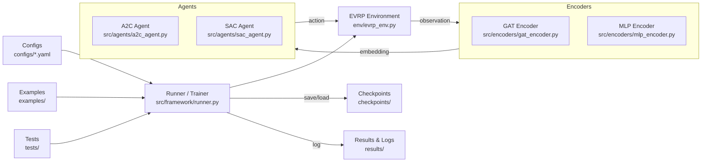
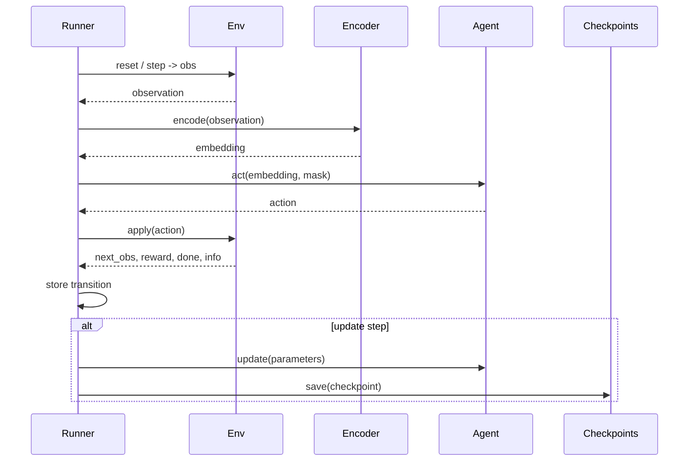

# EVRP-RL Architecture Diagram

This file provides a simple, standalone architecture diagram (Mermaid + ASCII fallback) that explains how the project components interact at runtime.

## Mermaid component diagram



## Sequence diagram (one training step)



## ASCII fallback

```
  [Configs YAML] -> [Runner/Trainer]
         |
         v
  [EVRP Environment] -> [Encoders] -> [Agents] -> [EVRP Environment]
         |                                   |
         +-> logs -> [Results & Metrics]     +-> saves -> [Checkpoints]

  Examples/Tests -> invoke Runner
```

## Notes (concise)

- Runner orchestration: reset/step env, encode observations, select actions with masking, apply actions, store transitions, and run updates according to algorithm (A2C/SAC).
- Encoders produce tensors shaped (batch, node_count, D); agents output actions or distributions over nodes.
- Checkpoints should contain model + optimizer states, trainer step/epoch, RNG states, and a config snapshot for reproducibility.
- Extension points: add new encoders under `src/encoders/`, new agents under `src/agents/`, and new environment variants under `env/`.

---

If you'd like, I can also:

- render this diagram as an SVG and save it to `docs/` for viewers that don't support Mermaid, or
- add a short `examples/resume_from_checkpoint.py` demonstrating loading a checkpoint and running evaluation.
